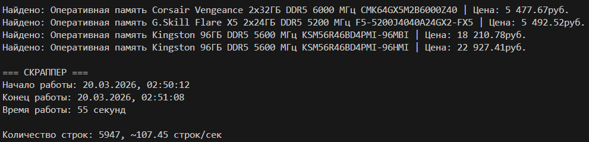
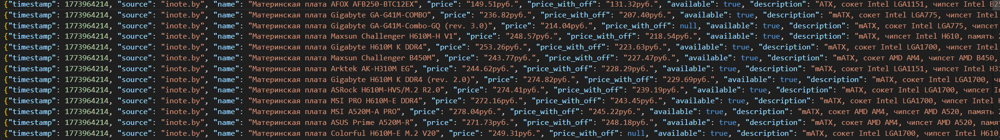
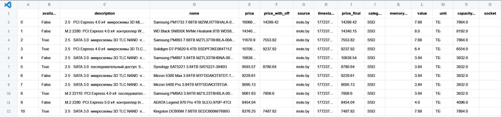

## 📊 Web scrapper
Скрапер для получения данных о компьютерных комплектующих с сайта inote.by

## ‼️Важно
Для работы требуется Java Developer Kit 17+

## ⚙️ Установка
1. **Клонируйте репозиторий**
```bash
git clone https://github.com/Deulix/scrapper.git
```
2. **Перейдите в папку проекта**
```bash
cd '.\scrapper\'
```
3. **Запустите через Docker Compose**
```
docker compose up -d
```

## 📁 Структура проекта
```
scrapper/
├── data/
│   ├── clean/
│   │   └── ...
│   └── raw/
│       └── ...
│   ├── scrapper/
│   │   └── scrapper.py
│   ├── settings/
│   │   └── config.py
│   ├── spark/
│   │   └── transform.py
│   └── main.py
├── tests/
|   └── ...
├── .dockerignore
├── .env
├── .gitignore
├── .python-version
├── pyproject.toml
├── README.md
└── uv.lock
```
# 📷 Примеры работы скрапера
- Результат работы в консоли



- Сырые данные



- Очищенные данные

